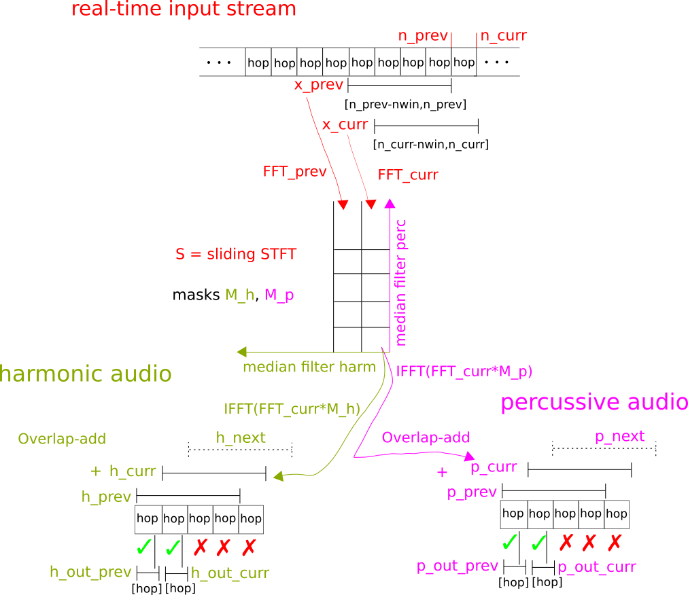
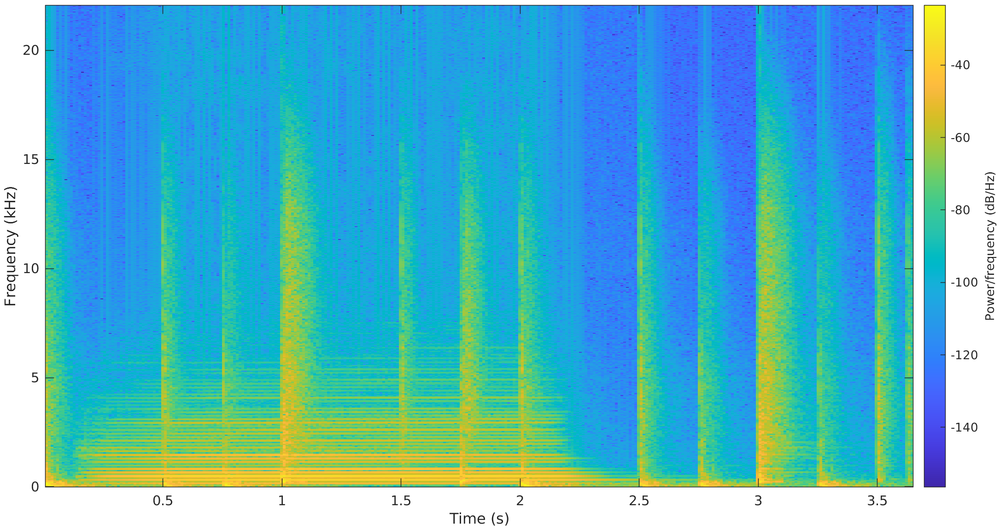
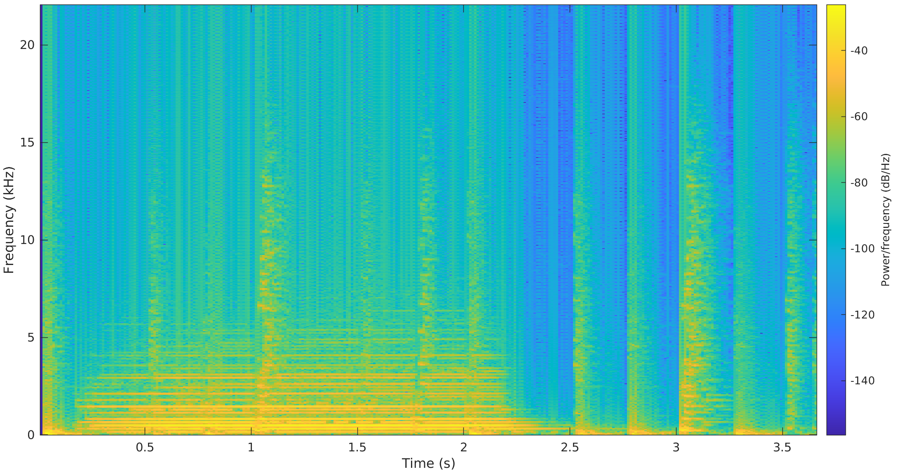
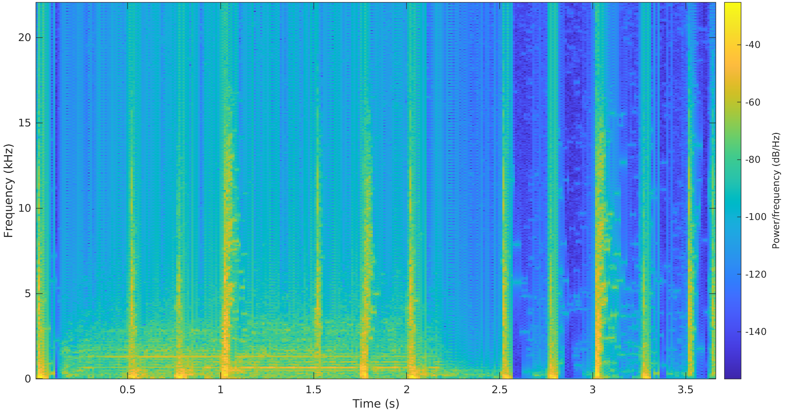
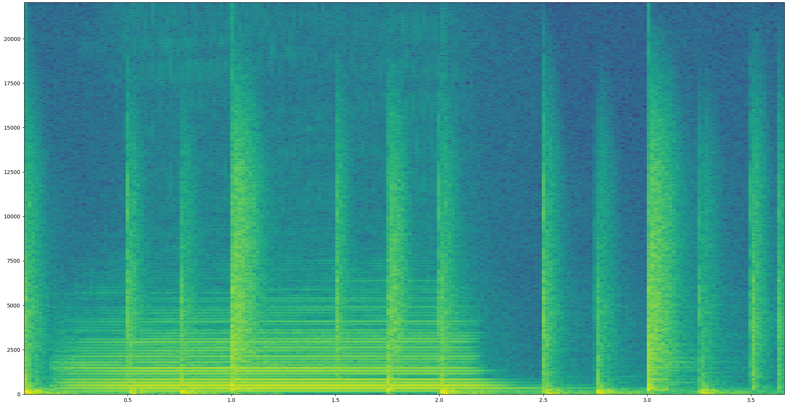
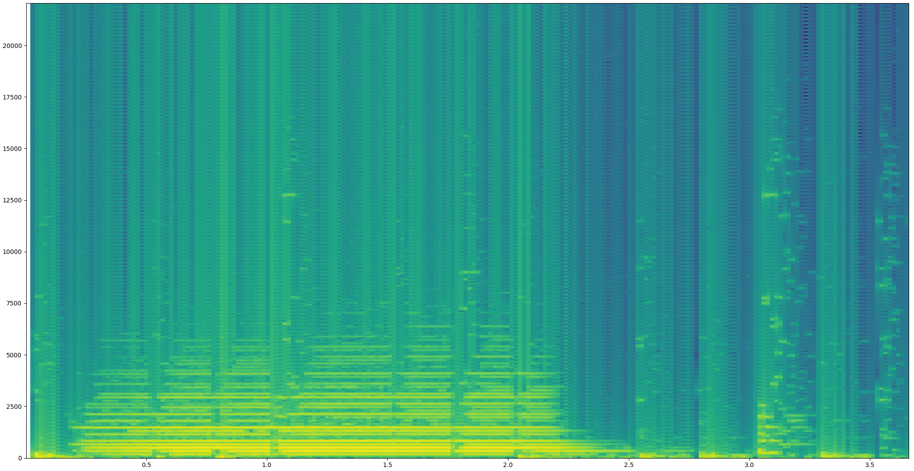
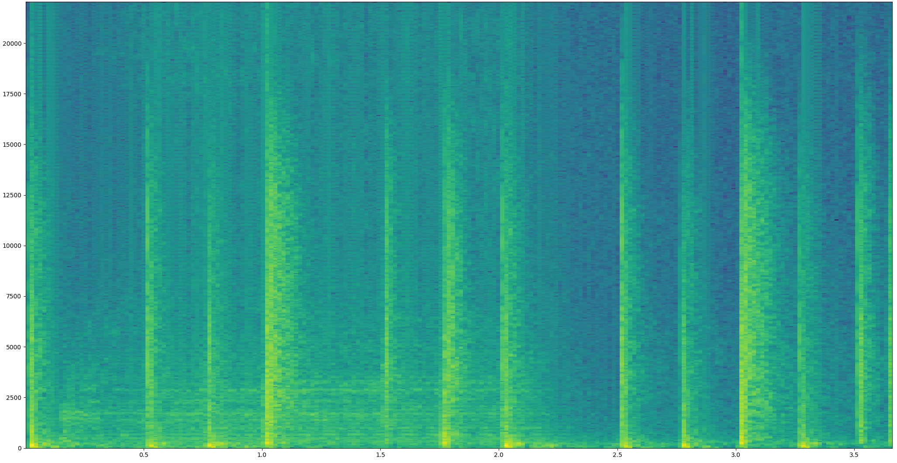

**:warning: WARNING 2020-03-01 :warning:**

The Python version of the code is buggy - the overlap-add reconstruction is incorrect. I believe it only works by luck.

The MATLAB version works fine. Also, I recommend you look at [Zen](https://github.com/sevagh/Zen), another one of my projects written in C++ and CUDA which is a very fast (160us!) implementation of the realtime HPSS idea, with correct overlap-add.

# Real-Time-HPSS

This repository contains a real-time implementation of the median-filtering HPSS algorithm [[1]](http://dafx10.iem.at/papers/DerryFitzGerald_DAFx10_P15.pdf), [[2]](https://www.audiolabs-erlangen.de/content/05-fau/assistant/00-driedger/01-publications/2014_DriedgerMuellerDisch_ExtensionsHPSeparation_ISMIR.pdf).

The original implementation uses the STFT/spectrogram of the audio signal to create harmonic and percussive masks, which are then applied to the STFT. The ISTFT is taken to create the separated harmonic and percussive audio signals. By combining the STFT and ISTFT loops and creating a sliding STFT, the separation can be done in real-time:



### MATLAB implementation

There's a [demo script](./matlab/HPSSMicrophone.m) which performs live, real-time HPSS on a microphone input stream (watch out for feedback - you should probably have your output and input devices in different rooms). PDFs of the report and presentation (built from the latex sources in this repo) are distributed as well on the [releases page](https://github.com/sevagh/Real-Time-HPSS/releases). The spectrograms below were created with [HPSSRtWav.m](./matlab/HPSSRtWav.m), a chunked processing of wav files to demonstrate the validity of real-time HPSS without the complications of microphone recordings.

Mixed spectrogram:



Real-time harmonic separation:



Real-time percussive separation:



### Python demo

The file [chunked_wav_example.py](./chunked_wav_example.py) uses the `hpss_rt` package in the [python subdirectory](./python):

```python
fs, x = scipy.io.wavfile.read("mixed.wav")
hpss = HPSSRT(fs)

h = numpy.ndarray(shape=x.shape)
p = numpy.ndarray(shape=x.shape)

x_ptr = 0
while x_ptr < len(x):
    if len(x[x_ptr : x_ptr + hpss.hop]) != hpss.hop:
        # skip uneven/non-hop-sized last chunk
        break
    h_, p_ = hpss.process_next_hop(x[x_ptr : x_ptr + hpss.hop])
    h[x_ptr : x_ptr + hpss.hop] = h_
    p[x_ptr : x_ptr + hpss.hop] = p_
    x_ptr += hpss.hop

scipy.io.wavfile.write("h_rt_sep_python.wav", fs, h)
scipy.io.wavfile.write("p_rt_sep_python.wav", fs, p)

fs, xm = scipy.io.wavfile.read("mixed.wav")
fs, xh = scipy.io.wavfile.read("h_rt_sep_python.wav")
fs, xp = scipy.io.wavfile.read("p_rt_sep_python.wav")
_, _, _, im = plt.specgram(xm, Fs=fs, NFFT=1024, noverlap=256)
plt.show()
_, _, _, im = plt.specgram(xh, Fs=fs, NFFT=1024, noverlap=256)
plt.show()
_, _, _, im = plt.specgram(xp, Fs=fs, NFFT=1024, noverlap=256)
plt.show()
```

Mixed spectrogram:



Real-time harmonic separation:



Real-time percussive separation:



### Project files

* audio - audio clips used throughout the report and presentation to generate results, plots
* images - plots, etc. for the report and presentation
* latex - latex files for the report and presentation PDFs
* matlab - matlab scripts
    * HPSS.m - median-filtering HPSS (with both the 2010 and 2014 techniques)
    * HPSSWav.m - a file that loads a wav file and applies HPSS.m
    * HPSSMicrophone.m - a real-time implementation that separates and outputs percussive or harmonic separations of the microphone input in real-time
    * HPSSRtWav.m - a modification of HPSSMicrophone.m to test the real-time implementation with wav files
* python (**nb!** buggy/suspicious STFT reconstruction) - python library + class, `from hpss_rt import HPSSRT`

### About this project

Real-Time-HPSS is presented as my final project for MUMT 501, Winter 2020.
